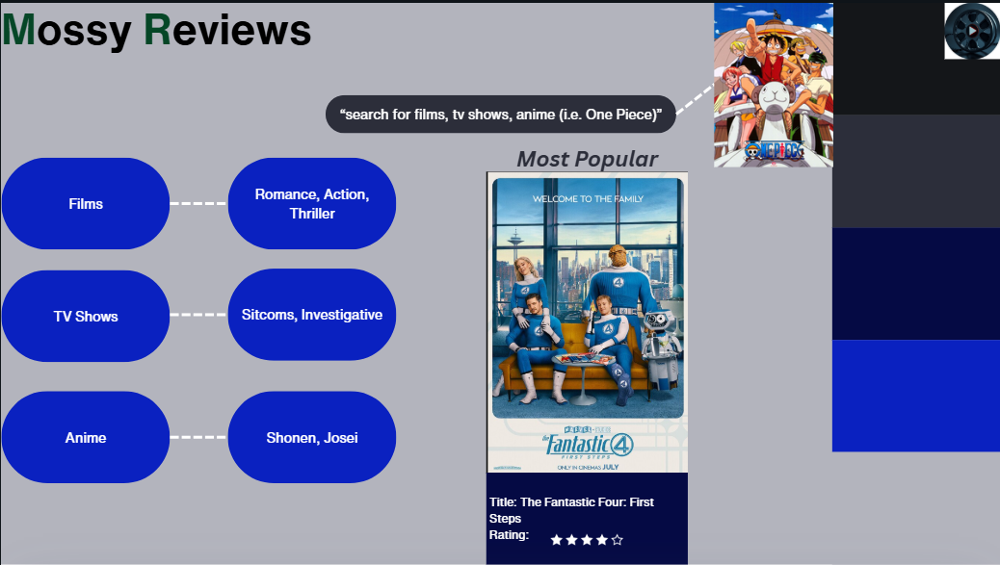
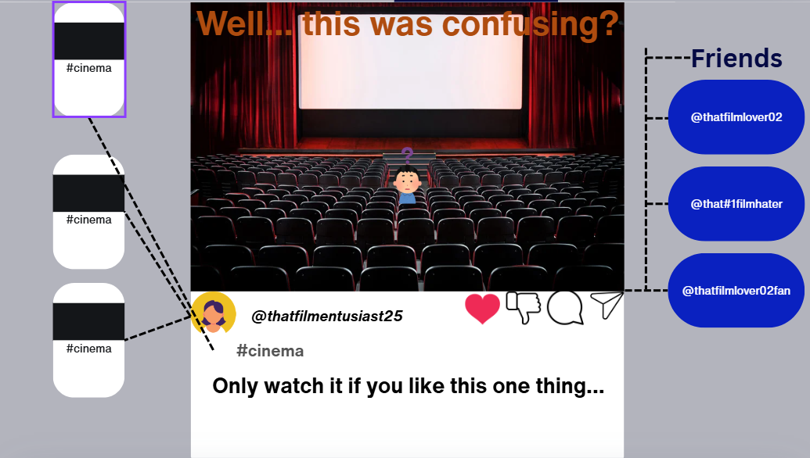

# first-repository

## Mossy Reviews

### About Us & Functional Requirements
Mossy Reviews is a website and social media platform designed to allow people to voice their opinions on films, shows, anime, and much more. This platform is catered specifically to this idea with the functions of allowing users to interact with other people, display a large gallery of media to critique, being able to post and having a functional and aesthetic sign in page. 

#### Non-Functional Requirements
Mossy Reviews aims to be a better website than others similar ones since it provides a smoothly run website, have a dislike button for posts to promote more freedom of expression, makes post be able to saved or sent to others showing its reusability and that it has a high scalability (better backend) so more posts, the gallery and data can increase. 

# TC001
Test Case Name: Verify User Login
Preconditions: User must have a registered account. 
Test Steps: 
1.  Open the application
2.  Enter valid username and passcode
3.  Click the "Login" button
Expected Result: The user is directed to the homepage
Actual Result: The user is directed to the homepage
Pass: Pass - The user is directed to the homepage
Priority: High

# TC002
Test Case Name: Verify User Login
Preconditions: User must have a registered account. 
Test Steps: 
1.  Open the application
2.  Enter valid username and passcode
3.  Click the "Login" button
Expected Result: The user is directed to the homepage
Actual Result: The user remains on the user login page
Fail: Fail - The user remains on the user login page
Priority: High

# Data Requirements
Stored data - Emails, passwords, usernames, movies catalogue. 
Displayed data - Movie catalogue and possibly username. 
Related data - User ID being used to connect aspects of if they have already logged in or already voted. 
Data types - Image data (profile pictures), textual data (which movie/show they voted for). 
Data queries - Querying of emails that have already voted for their favourite movie/show so they can not vote again. 

# Website Process: 
- Homepage was added with a grey background and the logo from the Year 9 Figma project. 

- The first established link to Weekly picks was established but there was no way to go back to the homepage. 
    - This error was resolved after rendering the template of menu.html under partials in main.py and also resolved issues for      all the other links as well. 

- Second link to an About Us page was made following the original colour scheme. 

- Third link to the Reviews page was done. 
    - Had a neutral colour scheme. 
    - Was not connected to a database. 

- Homepage was tidied up with a copyright being added to the pages to look more realistic.

# Unresolved Issues

- Sign up page was made in index.html but could not integrate with website since it looped the website to stay in the sign in page and did not go to menu.html. The sign up page was left out despite being crucial. 
- Database was not brought to the frontend from the backend to the extent required. 
- Creating a post is not a feature. 

# Final Lighthouse Performance

- 

- This is for desktop, on mobile the performance does not work since the largest visual element can not be loaded. 

# Acknowledgements of AI:

- Use of extension AI to resolve minor issues of the class, 'card', but most of the time was not used. 
- Use of ChatGPT to generate some text and fix formatting. Used to expand on elements in the 'css'. 

# End of Documentation
