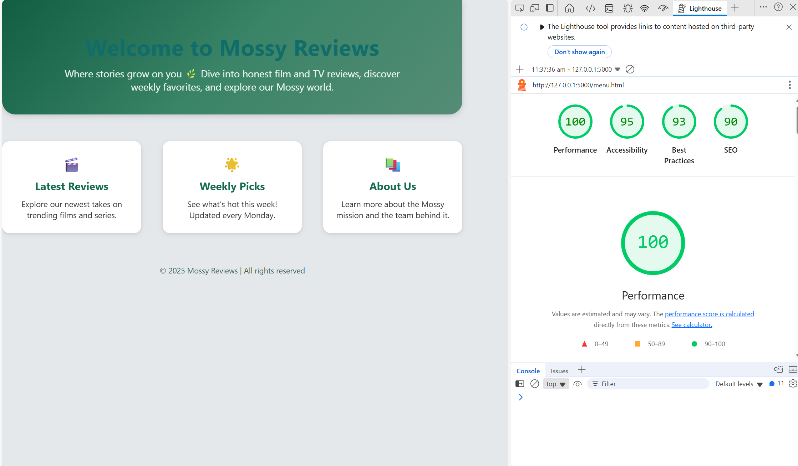

# first-repository

## Mossy Reviews

### About Us & Functional Requirements
Mossy Reviews is a website and social media platform designed to allow people to voice their opinions on films, shows, anime, and much more. This platform is catered specifically to this idea with the functions of allowing users to interact with other people, display a large gallery of media to critique, being able to post and having a functional and aesthetic sign in page. 

#### Non-Functional Requirements
Mossy Reviews aims to be a better website than others similar ones since it provides a smoothly run website, have a dislike button for posts to promote more freedom of expression, makes post be able to saved or sent to others showing its reusability and that it has a high scalability (better backend) so more posts, the gallery and data can increase. 

# TC001
Test Case Name: Verify User Login
Preconditions: User must have a registered account. 
Test Steps: 
1.  Open the application
2.  Enter valid username and passcode
3.  Click the "Login" button
Expected Result: The user is directed to the homepage
Actual Result: The user is directed to the homepage
Pass: Pass - The user is directed to the homepage
Priority: High

# TC002
Test Case Name: Verify User Login
Preconditions: User must have a registered account. 
Test Steps: 
1.  Open the application
2.  Enter valid username and passcode
3.  Click the "Login" button
Expected Result: The user is directed to the homepage
Actual Result: The user remains on the user login page
Fail: Fail - The user remains on the user login page
Priority: High

# Data Requirements
Stored data - 
Displayed data - 
Related data - 
Data types - 
Data queries - 